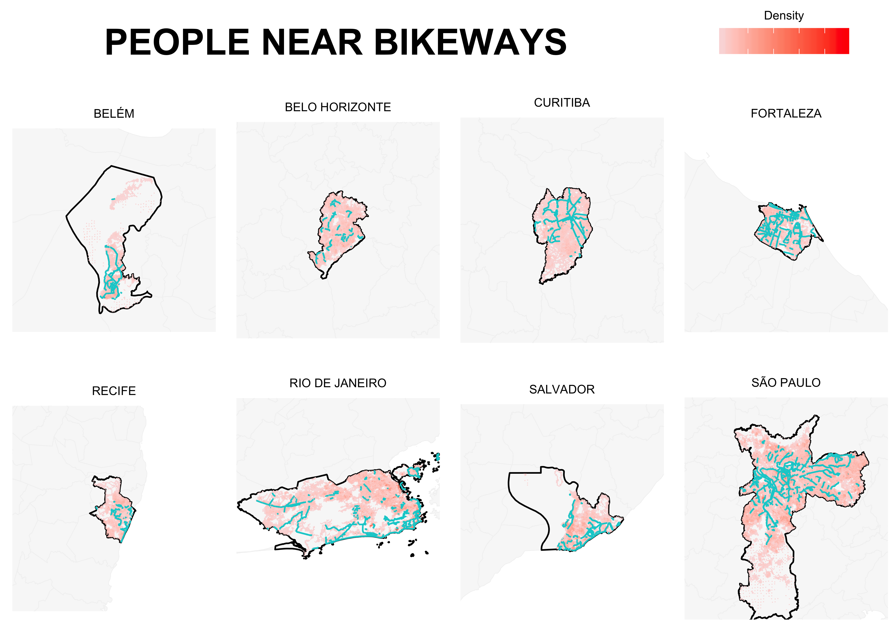

# Percentual de pessoas próximas da infraestrutura cicloviária - PNB

### O que é o indicador?

O indicador mensura o percentual da população de uma cidade que reside em um raio de até 300 metros da infraestrutura cicloviária. O resultado é obtido por recursos de geoprocessamento, considerando a distribuição da população e a localização da infraestrutura cicloviária na cidade.

O indicador pode ser utilizado para fins comparativos entre cidades, para avaliar a distribuição da infraestrutura no território e acompanhar a expansão do atendimento da infraestrutura cicloviária em relação à população residente. Ele também pode contribuir para a avaliação do atendimento e capilarização da infraestrutura cicloviária.

O ideal é que o indicador apresente tendência de crescimento ao longo do tempo.

# O que tem nessa pasta?

  - **Sobre_pnb**: informações gerais sobre indicador
  - **simples**: códigos para calcular o indicador considerando distância linear no entorno da infraestrutura cicloviária
  - **network**: códigos para calcular o indicador considerando distância pela rede de ruas no entorno da infraestrutura cicloviária
  - **mapas**: mapas do indicador

**Os resultados do indicador podem ser consultados na [MobiliDADOS](www.mobilidados.org.br).**

### O que é considerado infraestrutura cicloviária?

Consideram-se como infraestrutura cicloviária ciclovias e ciclofaixas.

### Como calcular?

#### Dados necessários:
- [Dados e feicoes](https://drive.google.com/drive/folders/1LZujtQv9Q3R_w096gI0tHQ6WJhlMbxcY) dos setores censitários
- Infraestrutura cicloviária mapeada no OpenStreetMap disponibilizada no [CicloMapa](https://ciclomapa.org.br/). O Projeto CicloMapa é opensource e pode ser consultado [aqui](https://github.com/cmdalbem/ciclomapa)

#### Realização do cáculo:
Para calcular o PNB é necessário rodar o código "cod_pnb" com o seguinte passo-a-passo:
1. Instalar pacotes e definir diretorio 
2. Criar funcao e realizar calculos do PNB

Os resultados gerados ao final apresentam o percentual da população total próxima da infraestrutura cicloviária e recortes por faixa de renda, gênero e raça e gênero e renda, utilizando variáveis abaixo:

| Variáveis | Dados do IBGE necessários |
|-----------|---------------------------|
|Populacao | **Quantidade de moradores em domicílios particulares permanentes ou população residente em domicílios particulares permanentes**. A variável V002 extraída da tabela Basico|
|DR_0_meio | **Domicílios particulares com rendimento nominal mensal domiciliar per capita entre 0 e meio salário mínimo**. A variável é o resultado do somatório das variáveis Domicílios particulares com rendimento nominal mensal domiciliar per capita de até 1/8 salário mínimo (V005),  Domicílios particulares com rendimento nominal mensal domiciliar per capita de mais de 1/8 a 1/4 salário mínimo (V006), Domicílios particulares com rendimento nominal mensal domiciliar per capita de mais de 1/4 a 1/2 salário mínimo (V007)  e a Domicílios particulares sem rendimento nominal mensal domiciliar per capita (V014) extraídas da tabela DomicilioRenda.|
|DR_meio_1|**Domicílios particulares com rendimento nominal mensal domiciliar per capita entre meio e 1 salário mínimo**. A variável corresponde à quantidade de domicílios particulares com rendimento nominal mensal domiciliar per capita de mais de 1/2 a 1 salário mínimo (V008) extraídas da tabela DomicilioRenda.|
|DR_1_3|**Domicílios particulares com rendimento nominal mensal domiciliar per capita entre 1 e 3 salários mínimos**. A variável é o resultado do somatório das variáveis Domicílios particulares com rendimento nominal mensal domiciliar per capita de mais de 1 a 2 salário mínimo (V009) e Domicílios particulares com rendimento nominal mensal domiciliar per capita de mais de 2 a 3 salário mínimo (V010) extraídas da tabela DomicilioRenda.|
|DR_3_mais|**Domicílios particulares com rendimento nominal mensal domiciliar per capita acima de 3 salários mínimos**. A variável é o resultado do somatório das variáveis Domicílios particulares com rendimento nominal mensal domiciliar per capita de mais de 3 a 5 salários mínimos (V011), Domicílios particulares com rendimento nominal mensal domiciliar per capita de mais de 5 a 10 salários mínimos (V012)  e Domicílios particulares com rendimento nominal mensal domiciliar per capita de mais de 10 salários mínimos (V013) extraídas da tabela DomicilioRenda.|
|Mulheres_Negras|**Mulheres negras**. A variável é o resultado do somatório de variáveis extraídas da tabela Pessoa03 (V168, V170, V173, V175, V178, V180, V183, V185, V198, V200, V203, V205, V208, V210, V213, V215, V218, V220, V223, V225, V228, V230, V233, V235, V238, V240, V243, V245) e Pessoa05 (V007 e V009).|
|Mulheres_RR_ate_2SM|**Mulheres com renda de até dois salários mínimos responsáveis por domicílio**. A variável é o resultado do somatório das variáveis Pessoas responsáveis com rendimento nominal mensal de até ½ salário mínimo, do sexo feminino (V045); Pessoas responsáveis com rendimento nominal mensal de mais de 1/2 a 1 salário mínimo, do sexo feminino (V046); Pessoas responsáveis com rendimento nominal mensal de mais de 1 a 2 salários mínimos, do sexo feminino (V047) extraídas da tabela ResponsavelRenda.|

### Exemplo de resultados

### Referências
- Ficha descritiva dos [indicadores apurados da MobiliDADOS](https://docs.google.com/spreadsheets/d/1Q5QuhNEcaMmNY9Wzke7DQ_ERiqcDiP6uGNtD5MwSsaY/edit#gid=0)
- [Vídeo](https://uniaodeciclistas.org.br/atuacao/ciclomapa/) com tutorial para realizar mapeamento cicloviário
- Link pra baixar o [R](https://www.rstudio.com/products/rstudio/download/#download) 
- Link para baixar [R Studio](https://cran.rstudio.com/) 

### Glossário

| Termo | Descrição |
|-------|-----------|
| Setor censitário | Unidade territorial de coleta das operações censitárias, definido pelo IBGE, com limites físicos identificados, em áreas contínuas e respeitando a divisão político-administrativa do Brasil.|
| Shapefile | Formato de arquivo contendo dados geoespaciais em forma de vetor usado por Sistemas de Informações Geográficas.|
| EPSG | Sigla para do Grupo Europeu de Pesquisa Petrolífera (European Petroleum Survey Group), que foi a entidade que organizou por meio desses códigos numéricos os Sistemas de Referência de Coordenadas (SRC) do mundo. Os EPSG de todas as capitais está contido na tabela de referência ("munis_df") criada no início do código apra calcular o PNB ("cod_pnb').

